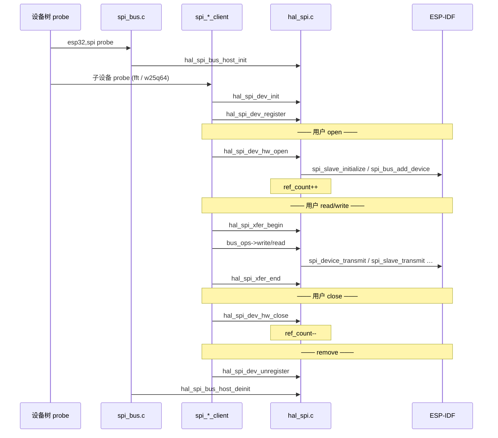

# SPI 子系统架构与调用关系

本文说明 mini_tree 中 SPI 从设备树 probe 到 HAL 硬件传输的分层结构、各模块职责，以及典型调用链。

---

## 1. 分层概览

```
┌─────────────────────────────────────────────────────────────────┐
│  应用 / 功能驱动                                                  │
│  fft_spi_drv (slave) · w25q64_spi_drv (master) · 其他业务驱动      │
└────────────────────────────┬────────────────────────────────────┘
                             │ VFS open/read/write/ioctl
┌────────────────────────────▼────────────────────────────────────┐
│  VFS SPI Client 层                                               │
│  spi_slave_client · spi_master_client                            │
│  (file_operations + dev_lifecycle + hal_spi_dev)                 │
└────────────────────────────┬────────────────────────────────────┘
                             │ hal_spi_dev_* / hal_spi_xfer_*
┌────────────────────────────▼────────────────────────────────────┐
│  HAL SPI 层  (本目录 hal_spi.c / hal_spi.h)                      │
│  hal_spi_bus_host · hal_spi_dev · bus_ops → ESP-IDF driver       │
└────────────────────────────┬────────────────────────────────────┘
                             │ spi_bus_initialize / spi_slave_initialize …
┌────────────────────────────▼────────────────────────────────────┐
│  ESP-IDF SPI 驱动 (driver/spi_master.h · driver/spi_slave.h)     │
└─────────────────────────────────────────────────────────────────┘
```

**VFS 总线控制器**（`vfs/spi/bus/spi_bus.c`）在 HAL 之上、Client 之下，负责从设备树创建 `hal_spi_bus_host`，本身不直接做 I/O。

---

## 2. 目录与文件

| 路径 | 文件 | 作用 |
|------|------|------|
| `hal_bus/spi/` | `hal_spi.h` / `hal_spi.c` | HAL 核心：总线 host、设备实例、路由表、bus_ops、ESP-IDF 封装 |
| `vfs/spi/bus/` | `spi_bus.c` | 设备树总线驱动：`esp32,spi` / `esp32,spi-master` → `hal_spi_bus_host_init` |
| `vfs/spi/master/` | `spi_master_client.c/h` | Master 侧 VFS client（open/close/read/write + transfer） |
| `vfs/spi/slave/` | `spi_slave_client.c/h` | Slave 侧 VFS client（open/close/read/write/ioctl，含异步 queue） |
| `vfs/spi/include/` | `spi_vfs.h` | SPI ioctl 命令与参数结构体 |
| `drivers/fft/` | `fft_spi_drv.c` | 示例：slave client 薄封装，`heterogeneous,fft-spi-slave` |
| `drivers/flash/` | `w25q64_spi_drv.c` | 示例：master client 内嵌 + `spi_master_client_transfer` |

---

## 3. 核心数据结构

### 3.1 `hal_spi_bus_host` — 总线控制器（全局，每 `host_id` 一份）

由 `esp32,spi` / `esp32,spi-master` probe 时创建，生命周期与总线控制器设备绑定。

| 字段 | 含义 |
|------|------|
| `dev` | 嵌入的 `bus_device_t`，对外暴露 `bus_ops` |
| `cfg` | 引脚、DMA、角色（master/slave）等总线级配置 |
| `bus_mutex` | 总线互斥锁，I/O 会话期间持有 |
| `ref_count` | `hal_spi_dev_hw_open` 引用计数 |
| `bus_ready` | probe 已完成软件侧总线准备 |
| `hw_inited` | ESP-IDF 侧 bus/slave 已 initialize |
| `active_cfg` | 当前生效的设备级配置（CS/mode 等） |
| `active_dev` | **I/O 会话**期间绑定的 `hal_spi_dev`（`xfer_begin` 设置） |

### 3.2 `hal_spi_dev` — SPI 设备实例（Client 持有）

每个 cascade 子设备（如 FFT SPI slave、W25Q64 master）对应一份。

| 字段 | 含义 |
|------|------|
| `host` | 所属 `hal_spi_bus_host` |
| `cfg` | 设备配置：mode、clock、CS、queue_size |
| `pool_idx` | 在 HAL 内部 hw 池中的索引 |
| `hw_open` | 是否已通过 `hal_spi_dev_hw_open` 绑定硬件 |

### 3.3 全局路由表 `s_registered_dev[]`

probe/bind 时 `hal_spi_dev_register` 写入；`bus_ops` 回调（write/read 等）通过 `host->active_dev` 或 hw 索引反查当前设备。  
**注意**：路由表注册 ≠ 硬件 open，二者在不同生命周期阶段完成。

---

## 4. 三类生命周期操作（勿混淆）

| 操作 | API | 时机 | 作用 |
|------|-----|------|------|
| **实例初始化** | `hal_spi_dev_init` | probe/bind | 填充 `hal_spi_dev` + 对应 `hal_spi_hw` 槽位 |
| **路由注册** | `hal_spi_dev_register` / `unregister` | probe/bind / remove | 写入/清除 `s_registered_dev[]`，供 bus_ops 反查 |
| **硬件 open/close** | `hal_spi_dev_hw_open` / `hw_close` | VFS open/close（首/末引用） | 调用 ESP-IDF `spi_bus_add_device` / `spi_slave_initialize`，增减 `ref_count` |
| **I/O 会话** | `hal_spi_xfer_begin` / `xfer_end` | 每次 read/write/ioctl | 持 `bus_mutex`、reconfigure、设置 `active_dev` |



---

## 5. 各模块职责

### 5.1 `spi_bus.c` — 总线控制器

- **compatible**：`esp32,spi`（slave 角色）、`esp32,spi-master`（master 角色）
- **probe**：解析 `host-id` / mosi / miso / sclk / dma-chan → `hal_spi_bus_host_init` → `bus_controller_bind`，`hw_priv` 指向 `hal_spi_bus_host`
- **remove**：解绑子 client → `hal_spi_bus_host_deinit`
- **不做**：具体 SPI 传输；不持有 `hal_spi_dev`

### 5.2 `hal_spi.c` — HAL 核心

| 职责 | 说明 |
|------|------|
| 总线 host 管理 | `s_spi_hosts[]`，每 host_id 唯一 |
| 硬件抽象 | `hal_spi_hw` 联合体（master handle / slave transaction） |
| bus_ops 实现 | `s_spi_master_bus_ops` / `s_spi_slave_bus_ops`，分发给 master/slave 实现 |
| 并发 | `bus_mutex` + `active_dev` 保证同 host 上 I/O 互斥 |
| ESP-IDF 封装 | `spi_bus_initialize`、`spi_slave_initialize`、`spi_device_transmit` 等 |

**bus_ops 路由逻辑**：回调从 `bus_device_t*` 反推 `hal_spi_bus_host`，再取 `host->active_dev`（须在 `xfer_begin` 之后有效）。

### 5.3 `spi_slave_client` — Slave VFS 层

- 内嵌 `struct hal_spi_dev spi_dev`
- **open/close**：`hal_spi_dev_hw_open/close`（配合 `dev_lifecycle` 引用计数）
- **write/read**：`dev_lc_io_begin` → `hal_spi_xfer_begin` → `host->dev.ops->write/read` → `hal_spi_xfer_end`
- **ioctl**（见 `spi_vfs.h`）：
  - `SPI_CMD_READ` — 同步读
  - `SPI_CMD_QUEUE_TX` — 异步入队（上半部，等主机时钟）
  - `SPI_CMD_GET_TRANS_RESULT` — 取异步结果（下半部）
  - `SPI_CMD_DEINIT` — 强制 hw_close
- **probe**：`hal_spi_dev_init` + `hal_spi_dev_register`；**remove** 时 `unregister`

### 5.4 `spi_master_client` — Master VFS 层

- 内嵌 `struct hal_spi_dev spi_dev`
- **open/close**：`spi_master_client_hw_open/close` → `hal_spi_dev_hw_open/close`
- **read/write**：经 `bus_ops` 走 master 同步传输
- **`spi_master_client_transfer`**：封装 `hal_spi_transfer`（全双工，内部自带 xfer 会话）
- 可被功能驱动内嵌（如 `w25q64_device.spi`），通过 `spi_master_client_bind` 绑定而不注册独立 compatible

### 5.5 功能驱动（示例）

| 驱动 | 方式 | 典型调用 |
|------|------|----------|
| `fft_spi_drv` | 转发到 `spi_slave_client_probe/remove` | 应用 `open` → `write` / `ioctl(QUEUE_TX)` |
| `w25q64_spi_drv` | 内嵌 `spi_master_client`，自行实现 `file_operations` | `spi_master_client_transfer` 读写 Flash |

---

## 6. HAL API 速查

### 总线（Bus 层）

| API | 作用 |
|-----|------|
| `hal_spi_bus_host_init/deinit` | 创建/销毁 host 软件实体 |
| `hal_spi_bus_host_get` | 按 host_id 获取 host 指针 |
| `hal_spi_host_bus` | host → `bus_device_t*` |

### 设备（Dev 层）

| API | 作用 |
|-----|------|
| `hal_spi_dev_init` | 初始化设备实例与 hw 槽位 |
| `hal_spi_dev_register/unregister` | 注册/注销全局路由表 |
| `hal_spi_dev_hw_open/close` | 绑定/解绑 ESP-IDF 硬件 |
| `hal_spi_bus_reconfigure` | I/O 前切换 CS/mode（master 多 CS；ESP32 slave 首次后多为 no-op） |
| `hal_spi_xfer_begin/end` | I/O 会话：加锁 + reconfigure + 绑定 `active_dev` |
| `hal_spi_transfer` | Master 全双工（内部 begin/end） |
| `hal_spi_get_trans_result` | Slave 异步事务结果捞取 |

### 辅助 inline

| API | 作用 |
|-----|------|
| `hal_spi_bus_queue_tx` | 调用 `bus_ops->transfer_async` |
| `hal_spi_bus_supports_async_tx` | 判断是否支持异步入队 |

---

## 7. Master 与 Slave 差异

| 项目 | Master | Slave |
|------|--------|-------|
| 总线 compatible | `esp32,spi-master` | `esp32,spi` |
| ESP-IDF 初始化 | `spi_bus_initialize` + `spi_bus_add_device` | `spi_slave_initialize`（每 host 通常一个 CS/mode） |
| 传输方式 | 同步 `spi_device_transmit` | 同步 `spi_slave_transmit` 或异步 queue + get_result |
| `transfer_async` | 不支持（NULL） | 支持（上半部入队） |
| 多设备同 host | 多 CS，各自 `hal_spi_dev` + add_device | ESP32 限制：同 host 仅允许相同 CS/mode 的一个 active 硬件配置 |
| 典型 client | `spi_master_client` / w25q64 | `spi_slave_client` / fft |

---

## 8. 典型调用链

### 8.1 Slave 同步写

```
应用 write()
  → spi_slave_write()
    → dev_lc_io_begin()
    → hal_spi_xfer_begin(&spi_dev)
    → bus_ops->write()                    [hal_spi.c: spi_bus_write_impl]
      → spi_host_active_dev() → spi_dev_hw()
      → spi_slave_setup_trans + spi_slave_transmit
    → hal_spi_xfer_end()
    → dev_lc_io_end()
```

### 8.2 Slave 异步 TX（上半部 / 下半部）

```
ioctl(SPI_CMD_QUEUE_TX)
  → hal_spi_xfer_begin()
  → hal_spi_bus_queue_tx()
    → bus_ops->transfer_async()           [spi_bus_write_top_half_impl]
      → spi_slave_queue_trans()
  → hal_spi_xfer_end()

ioctl(SPI_CMD_GET_TRANS_RESULT)
  → hal_spi_get_trans_result()
    → spi_slave_get_trans_result()
```

### 8.3 Master 全双工（W25Q64）

```
w25q64 内部
  → spi_master_client_transfer(&flash->spi, tx, rx, len, tmo)
    → hal_spi_transfer()
      → hal_spi_xfer_begin()
      → spi_master_transmit()             [spi_device_transmit]
      → hal_spi_xfer_end()
```

### 8.4 设备树启动顺序

```
1. esp32,spi / esp32,spi-master  probe  → hal_spi_bus_host_init
2. cascade 子节点 probe
     heterogeneous,fft-spi-slave  → spi_slave_client_probe
     heterogeneous,w25q64-master  → w25q64_spi_probe → spi_master_client_bind
3. 应用 open 子设备  → hal_spi_dev_hw_open
4. 应用 I/O
5. 应用 close  → hal_spi_dev_hw_close
```

---

## 9. 并发与状态

- **Client 级**：`dev_lifecycle` + `io_mutex`，保证同一 VFS 设备上的 open/close/I/O 序列化。
- **Host 级**：`bus_mutex`，`xfer_begin` 到 `xfer_end` 之间独占总线；`active_dev` 指向当前会话设备。
- **Slave 异步**：`trans_queued` 原子标志防止重复入队；`GET_TRANS_RESULT` 完成后清除。

---

## 10. 扩展新 SPI 设备 checklist

1. 设备树：挂到正确的 SPI 总线节点下，配置 `cs-port/cs-pin`、`spi-mode`、`spi-max-frequency` 等。
2. **Slave 设备**：注册 compatible → 在 probe 中调用 `spi_slave_client_probe`，或仿照 `fft_spi_drv` 薄封装。
3. **Master 设备**：在功能驱动中内嵌 `spi_master_client`，probe 时 `spi_master_client_bind`；I/O 用 `spi_master_client_transfer` 或自行 `hal_spi_xfer_begin` + bus_ops。
4. 区分 probe 阶段（`init` + `register`）与 open 阶段（`hw_open`），不要在 probe 里调用 `hw_open`。
5. 所有经 bus 的 I/O 必须在 `hal_spi_xfer_begin/end` 之间（`hal_spi_transfer` 已内置）。

---

## 11. 相关头文件

- HAL 入口：`hal_bus/spi/hal_spi.h`
- VFS ioctl：`vfs/spi/include/spi_vfs.h`
- 通用总线抽象：`hal_bus/bus/bus.h`（`bus_device_t`、`bus_ops_t`）
